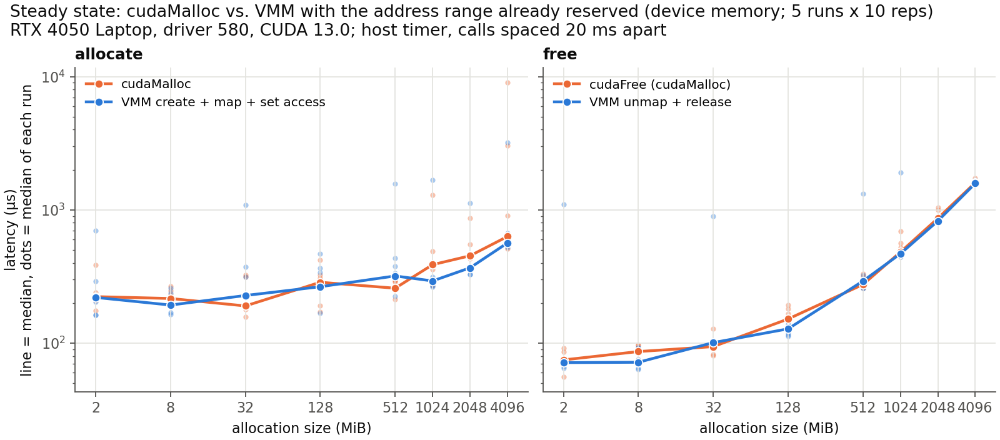
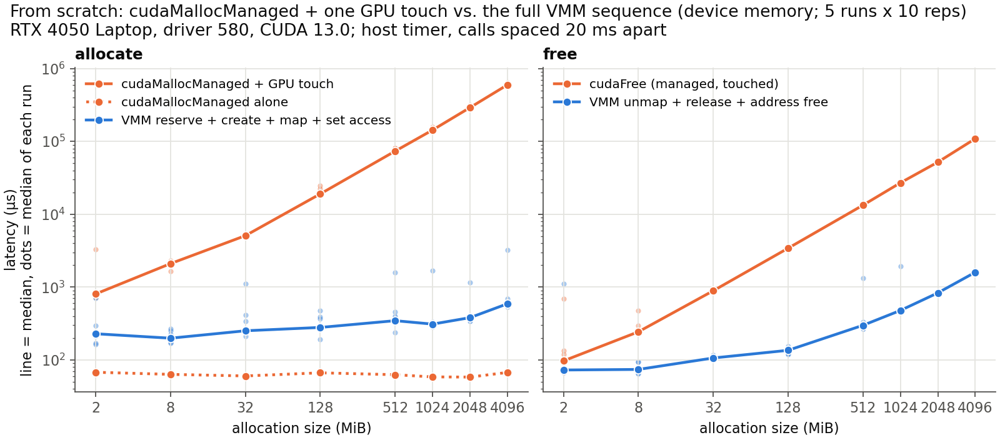

# VMM call latency

How long each CUDA VMM call takes on this machine, from 2 MiB to 4 GiB, for device and pinned host (`HOST_NUMA`) backing, and how that compares with `cudaMalloc` and `cudaMallocManaged`. Tracker 5A.

```
./run.sh        # per-call latency: build, trace with nsys, analyse (about 2 min); ./run.sh 50 for more reps
./compare.py    # cudaMalloc / cudaMallocManaged vs. VMM, 5 runs (about 2 min); --plot to redraw only
```

## Summary

- **Device memory: cost is fixed, not proportional to size.** Making a device buffer usable (create + map + set access) takes 0.16 to 0.3 ms from 2 MiB to 4 GiB, and `cuMemSetAccess` is the largest part. Freeing grows with size through `cuMemRelease` (1.5 ms at 4 GiB).
- **Host memory: every call that touches pages is linear in size.** Create costs 115 µs/MiB, set access 8.8 µs/MiB, release 23 µs/MiB. Backing 1 GiB on the host takes about 120 ms, more than copying 1 GiB over PCIe (about 80 ms at 13 GB/s).
- **VMM costs the same as `cudaMalloc`/`cudaFree`**, because `cudaMalloc` does the same steps in one call. `cudaMallocManaged` looks cheap (60 µs) only because it allocates nothing; backing its pages by GPU faults costs 0.15 ms/MiB, up to 1000x the VMM sequence.
- **The cost can be hidden.** All of these calls can run off the application's critical path, in a daemon, ahead of need, so their exact latency matters less than their order of magnitude.

## Method

`vmm_latency.cu`: each repetition runs reserve, create, map, set access, unmap, release and address free on a fresh allocation inside one NVTX range; nsys traces the driver calls and `analyze.py` attributes each call to its range. Sizes 2, 8, 32, 128, 512, 1024, 2048 and 4096 MiB; device vs. host; read/write vs. read-only access; 20 reps after 3 warm-up reps; all configurations in one shuffled order (fixed seed). Reps are spaced by a 20 ms busy-wait so that background work from the previous free finishes and each call's own cost shows.

`alloc_compare.cu`: the same sizes, shuffle and spacing, but with a plain host timer and no nsys. It times `cudaMalloc`, `cudaMallocManaged` followed by one GPU kernel that writes every 4 KiB page, and the VMM sequence; `compare.py` sums the VMM phases so each comparison yields the same usable device buffer. 5 runs (separate processes, different shuffle) of 10 reps, 50 samples per point.

Outputs in `results/`: `latency.csv`, `fit.csv`, `vmm_latency.png`, `vmm_backtoback.png`, `alloc_compare.csv`, `alloc_compare_raw.csv`, `vs_cudamalloc.png`, `vs_cudamallocmanaged.png`. Published numbers for comparison: `published.md`.

## Where the cost lies


Fit of `latency = fixed + per_MiB × size` to the medians (weighted by 1/median so small sizes count; `results/fit.csv`). The dotted line on the plots has slope 1: a call that grows linearly with size runs parallel to it.

| Call | Device fixed (µs) | Device per MiB (µs) | Host fixed (µs) | Host per MiB (µs) |
|---|---|---|---|---|
| cuMemCreate | 71 | ~0 | 101 | 115 |
| cuMemMap | 3.4 | ~0 | 5.9 | ~0 |
| cuMemSetAccess | 91 | 0.036 | 98 | 8.8 |
| cuMemUnmap | 37 | ~0 | 57 | 1.2 |
| cuMemRelease | 26 | 0.37 | ~0 | 23 |

Totals per buffer (medians, µs):

| Size | Device alloc | Device free | Host alloc | Host free |
|---|---|---|---|---|
| 2 MiB | 158 | 58 | 431 | 101 |
| 128 MiB | 185 | 118 | 21,159 | 3,242 |
| 1 GiB | 223 | 456 | 119,252 | 31,986 |
| 4 GiB | 305 | 1,547 | 486,410 | 134,883 |

Alloc = create + map + set access; free = unmap + release.

- **Device.** Create (71 µs) and map (3 µs) are flat. Set access is the largest allocation cost and the only one that grows (83 µs at 2 MiB, 229 µs at 4 GiB). Unmap is flat; release grows by 0.37 µs/MiB.
- **Host.** Create dominates (450 ms at 4 GiB); set access and release are the next largest. Only map stays flat.
- **Map is cheap everywhere** (2 to 10 µs). Read-only and read/write access cost the same (within 25% at every size).
- **Reserve and address free are left out** of the table and plots. They only reserve or return a range of the process's GPU virtual address space: no physical memory, no page-table writes, no GPU work. They cost 1 to 20 µs at every size and location, with a step between 8 and 32 MiB that the linear model does not fit (probably a different alignment or address pool for larger ranges; not confirmed).

## What the calls do underneath

The driver's resource manager, which does the VMM and `cudaMalloc` work, ships as a binary, so the device and host explanations below are inferred from the timings. The managed-memory part is checked against the `nvidia-uvm` source (driver 580.178.04).

- **Device `cuMemCreate` (flat):** takes physical VRAM pages from the driver's allocator without clearing or touching them.
- **`cuMemMap` (flat):** records which handle backs which address range. Too cheap to involve the GPU.
- **`cuMemSetAccess`:** writes the GPU page-table entries for the range and flushes the GPU's address-translation cache; this is where the mapping takes effect. Device memory uses 2 MiB pages, so 4 GiB is 2048 entries at about 0.07 µs each. Host memory costs 250x more per MiB, consistent with 4 KiB pages: 256 entries per MiB at about 0.03 µs each, the same order per entry.
- **Host `cuMemCreate` (about 9 GB/s):** allocates system pages, zeroes them, pins them and maps them for DMA, 0.45 µs per 4 KiB page.
- **`cuMemUnmap`:** clears the entries and flushes the translation cache. **`cuMemRelease`:** returns pages to the allocator, 0.75 µs per 2 MiB device page, or unpins and frees 4 KiB host pages. Freed VRAM is cleared later in the background (see the back-to-back case below).
- **`cudaMalloc` / `cudaFree`:** the same steps in one call each. `cudaFree` also waits for all GPU work in the context; the GPU was idle here, so that wait does not show.
- **`cudaMallocManaged`:** reserves the address range and creates `nvidia-uvm` bookkeeping in 2 MiB VA blocks. No memory is allocated.
- **First GPU touch of managed memory:** each access to an unbacked page faults. `nvidia-uvm` fetches faults in batches (up to 256, `uvm_perf_fault_batch_count`), and for each 2 MiB block allocates a GPU chunk, zeroes it (`block_zero_new_gpu_chunk` in `uvm_va_block.c`), maps it and replays the faulting accesses. Zeroing 4 GiB at VRAM speed (187 GB/s) takes under 25 ms, so fault handling accounts for most of the 0.6 s.
- **`cudaFree` of touched managed memory:** destroys every VA block, unmapping and freeing its chunks one block at a time, about 53 µs per 2 MiB block.

## Hiding the cost

None of these calls needs to sit on an application's critical path. In a daemon-based design:

- **Remaps run asynchronously** with respect to the application: the daemon remaps a chunk while unrelated kernels keep running (a 64 MiB remap took about 16 ms while a 450 ms kernel ran, in an earlier probe).
- **Host backing can be created ahead of need.** Host create is the largest cost (about 110 ms/GiB), so a pool of pre-created host handles turns an eviction into unmap, copy and map.
- **Release can be deferred** to idle time, since it is the largest device-side free cost.
- **Address ranges are reserved once.** Reserve and address free are cheap anyway.

## Compared with cudaMalloc and cudaMallocManaged




`vs_cudamalloc.png` is the steady state: `cudaMalloc` vs. create + map + set access in an already reserved range, `cudaFree` vs. unmap + release. `vs_cudamallocmanaged.png` starts from scratch: `cudaMallocManaged` plus the touch kernel vs. reserve + create + map + set access, and `cudaFree` vs. unmap + release + address free.

| MiB | cudaMalloc | VMM alloc | cudaFree | VMM free | managed + touch | its cudaFree |
|---|---|---|---|---|---|---|
| 2 | 223 | 220 | 75 | 71 | 806 | 97 |
| 128 | 286 | 265 | 152 | 128 | 19,021 | 3,415 |
| 1024 | 388 | 293 | 481 | 468 | 143,198 | 26,976 |
| 4096 | 631 | 564 | 1,600 | 1,580 | 597,528 | 108,885 |

Median µs over 50 samples, device memory. Reserve and address free add under 30 µs to the VMM columns.

- **`cudaMalloc`:** allocation within 0.75 to 1.25x of VMM, free within 17%. VMM adds no cost over `cudaMalloc`; it only exposes the steps. 28% of VMM and 23% of `cudaMalloc` allocations took over 1 ms, so medians vary between runs.
- **`cudaMallocManaged`:** the call itself is about 60 µs at every size. The cost moves to first touch, 0.15 ms/MiB (0.6 s for 4 GiB, about 7 GB/s), 3 to 1000x the VMM sequence; its `cudaFree` is about 70x the VMM teardown at 4 GiB. VMM pays a bounded cost up front, outside kernels; UVM pays inside the kernel that first touches the memory.

## Pathological case: back to back


Device `cuMemSetAccess` and `cuMemUnmap` sometimes take about 2 ms instead of tens of µs, at every size. With no gap between reps, 62 of 160 calls of each stall; spaced 20 ms apart, 27 to 30 of 160. Spaced stalls almost all follow a large device free (17 of 25 after a 2 GiB free, 13 of 25 after 4 GiB, 0 to 1 after any host free). The likely cause is the driver clearing freed VRAM in the background, so the next mapping waits; not confirmed. A daemon should avoid mapping right after freeing a large device buffer.

## Caveats

- One machine. The per-call numbers are one run of 20 reps per point; the comparison is 5 runs of 10. Device medians vary between runs because of the stalls above. The aim is the order of magnitude of each cost and where it lies, not exact timings: in practice a daemon issues these calls asynchronously to the application.
- Spacing calls changes CPU and GPU power state: a 20 ms *sleep* made even the CPU-only `cuMemMap` up to about 15x slower, so the gap is a busy-wait. Real latency depends on what ran just before.
- Compared with vAttention's 2 MB numbers (create 29, set access 38, unmap 34 µs; GPU not stated), our device calls are about 1 to 2.5x slower.
