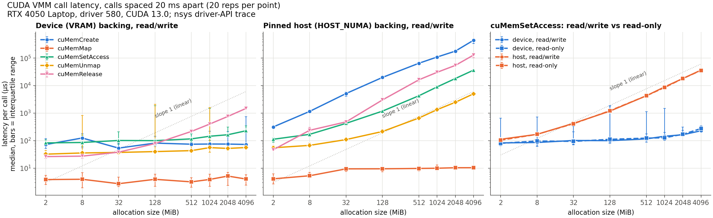
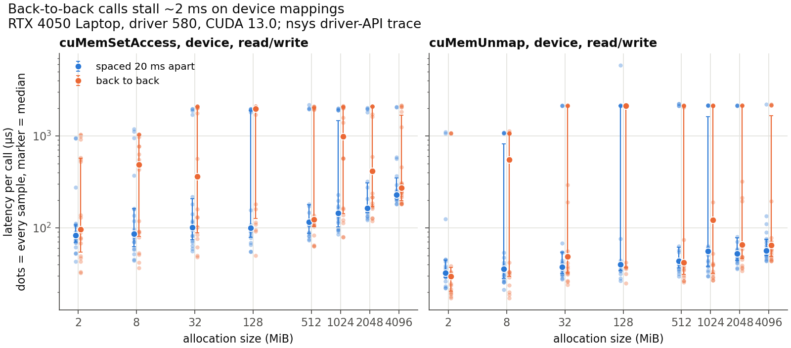

# VMM call latency

How long each CUDA VMM call takes on this machine, for 2 MiB to 4 GiB, device vs. pinned host backing, read/write vs. read-only access. Tracker 5 (UVM vs. VMM study).

```
./run.sh        # build, trace with nsys, export, analyse (about 2 min); ./run.sh 50 for more reps
```

Each repetition runs `reserve, create, map, set access, unmap, release, address free` on a fresh allocation, inside one NVTX range. nsys traces the driver API; `analyze.py` matches every call to its range. All configurations run in one shuffled order (fixed seed), 20 reps each after 3 warm-up reps, in two modes:

- **spaced:** 20 ms busy-wait between reps, so the driver's background work from the previous free has finished.
- **back to back:** no gap.

Outputs in `results/`: `latency.csv` (median, quartiles, max per mode, location, size, access, call), `vmm_latency.png`, `vmm_backtoback.png`. Published numbers for comparison: `published.md`.




## Results (spaced, read/write)

Fit of `latency = fixed + per_MiB × size` to the medians (weighted by 1/median so small sizes count; `results/fit.csv`). The dotted line on the plots is slope 1: a call that grows linearly with size runs parallel to it.

| Call | Device fixed (µs) | Device per MiB (µs) | Host fixed (µs) | Host per MiB (µs) |
|---|---|---|---|---|
| cuMemCreate | 71 | 0.001 | 101 | 115 |
| cuMemMap | 3.4 | 0.000 | 5.9 | 0.002 |
| cuMemSetAccess | 91 | 0.036 | 98 | 8.8 |
| cuMemUnmap | 37 | 0.006 | 57 | 1.2 |
| cuMemRelease | 26 | 0.37 | ~0 | 23 |

Reserve and address free are 1 to 20 µs and do not follow the model (a step between 8 and 32 MiB), so they are left out. Host release's fixed cost fits to slightly below zero; shown as ~0. Per-call medians for every size are in `results/latency.csv`.

- **Device memory: almost all fixed cost.** Create, map and unmap stay flat from 2 MiB to 4 GiB (3 to 75 µs); set access grows slowly (83 to 229 µs); only release grows clearly (0.37 µs/MiB, 1.5 ms at 4 GiB).
- **Host memory: linear in size** (lines parallel to slope 1). Create costs about 115 µs/MiB (1 GiB took 110 ms, 4 GiB 450 ms), set access about 8.8 µs/MiB, release about 23 µs/MiB. So moving a buffer to host costs more to allocate its host backing (about 110 ms per GiB) than to copy it (about 80 ms per GiB at 13 GB/s).
- **Read-only vs. read/write access costs the same** within run-to-run noise (within 25% at every size).
- **Map is cheap everywhere** (2 to 10 µs); the cost of making memory usable is in create and set access.
- **Device set access and unmap sometimes stall about 2 ms**, at every size: 62 of 160 calls each back to back, 27 and 30 of 160 spaced. Spaced stalls almost all follow a large *device* free (17 of 25 after a 2 GiB free, 13 of 25 after 4 GiB; 0 to 1 after any host free). Most likely the driver clearing freed VRAM in the background (4 GiB at VRAM speed is about 20 ms, the length of the gap), so the next mapping waits. Inferred, not confirmed in driver source.
- Compared with vAttention's 2 MB numbers (create 29, set access 38, unmap 34 µs; GPU not stated), our device calls are about 1 to 2.5x slower.

## Caveats

- One machine, one run of 20 reps per point. Device medians varied noticeably between trial runs, because of the bimodal stalls.
- Spacing calls changes CPU and GPU power state: a 20 ms *sleep* made even the CPU-only `cuMemMap` up to about 15x slower, so the gap is a busy-wait. Real latency depends on what ran just before.
- nsys measures host-side call duration.
